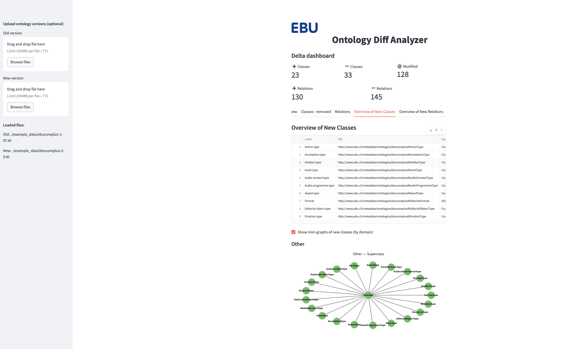

# EBU Ontology Diff Analyzer 

Visualize and compare two ontology versions, highlighting changes in classes and relations.

[](https://ebu-oda.streamlit.app)

---

## 🖥️ Example UI

 

---

## 🚀 Try it Live

**[Launch the app →](https://ebu-oda.streamlit.app)**

---

## 📦 How to Run Locally

```bash
pip install -r requirements.txt
streamlit run app.py


