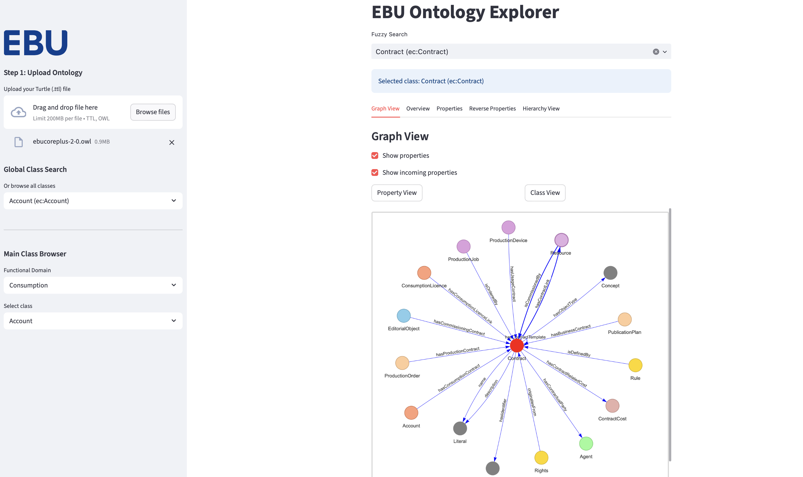

<p align="center">
  
</p>

<h1 align="center">Ontology Explorer</h1>

<p align="center">
  A user-friendly tool to explore and understand RDF/OWL ontologies.
</p>

---

## 🎬 Demo

<p align="center">
  <a href="https://onto-explorer.streamlit.app/" target="_blank">
    
  </a>
</p>

<p align="center">
  👉 Try it live now: <strong><a href="https://onto-explorer.streamlit.app/">onto-explorer.streamlit.app</a></strong>
</p>

---

## ✨ Features

- 🔍 Fuzzy search with autocomplete
- 🧭 Class selection by functional domain
- 🧠 Interactive semantic graph using `pyvis`
- 🔗 Displays subclasses, superclasses, restrictions, reverse links, and SKOS info

---

## 🚀 Run the Explorer Locally

```bash
git clone https://github.com/yourusername/OntologyExplorer.git
cd OntologyExplorer
python -m venv venv
source venv/bin/activate        # On Windows: venv\Scripts\activate
pip install -r requirements.txt
streamlit run main.py
```

Then open your browser at [http://localhost:8501](http://localhost:8501)

---

## ☁️ Run it on Streamlit Cloud

No setup needed — just click and try:

👉 https://onto-explorer.streamlit.app/

---

## 📄 License

MIT License © 

---

## 🙌 Acknowledgements

- [EBU](https://tech.ebu.ch/metadata/ebucoreplus) — for the EBUCorePlus ontology
- [rdflib](https://rdflib.readthedocs.io/) — for semantic RDF parsing
- [pyvis](https://pyvis.readthedocs.io/) — for graph visualization
- [streamlit](https://streamlit.io/) — for building this web UI

---

## 💬 Feedback

Found a bug? Want to contribute?  
Open an issue or pull request — feedback is always welcome!
